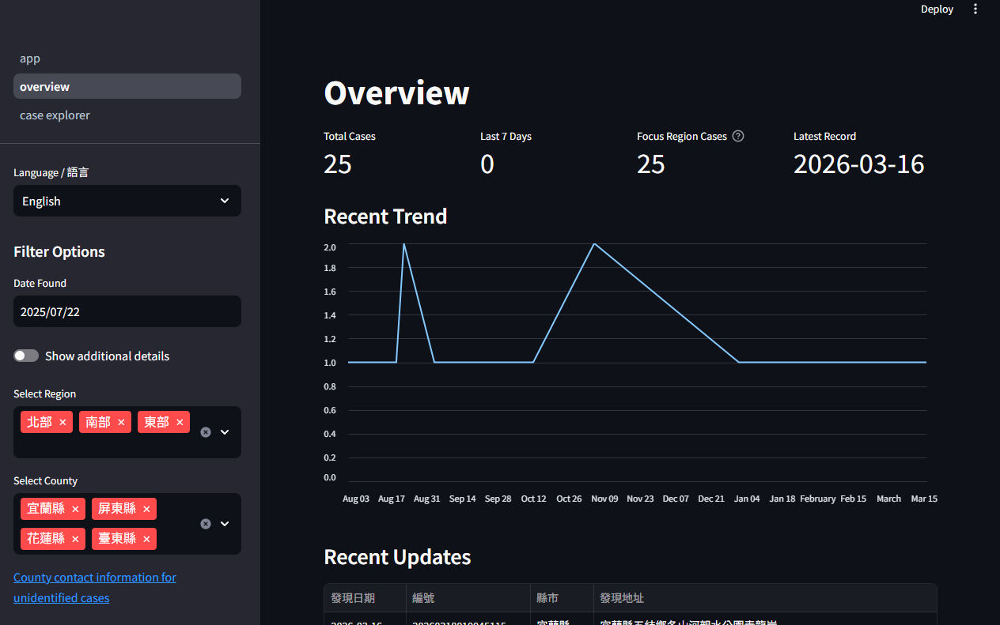
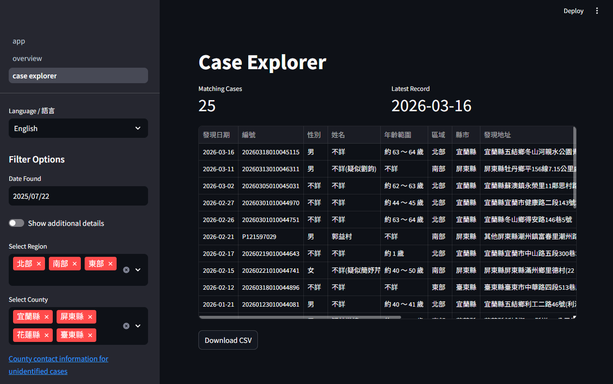

# [Taiwan Unidentified Cases Monitoring Dashboard](https://taiwan-unidentified-case-monitor.streamlit.app/Case_Explorer) 

End-to-end analytics system for ingesting, cleaning, and monitoring semi-structured public records of unidentified cases, with interactive visualization and automated alerts.

## 🚧 Project Status

This project is actively under development.

Current capabilities:
- Data pipeline (API ingestion → cleaning → CSV output)
- Interactive Streamlit dashboard with filtering
- Telegram alerts for newly detected cases

Ongoing work:
- Geographic visualization (heatmap, choropleth)
- Trend analysis and anomaly detection
- Dashboard layout and UX improvements

## Project Overview

This project retrieves unidentified case records from a public data source and transforms semi-structured JSON data into a structured dataset for analysis.

The project was inspired by the [original website](https://nservice.moj.gov.tw/deadbook/#), which provides valuable information but has limited support for filtering and exploration. To address this, I developed a more user-friendly interface with additional capabilities for tracking updates and analyzing regional trends.

It was also motivated by a personal interest in following specific cases over time, and later evolved into a reusable analytics system in combination with data ingestion, transformation, visualization, and monitoring.

## Architecture

The system follows a lightweight ETL-style workflow, where raw data is ingested, standardized, and stored as an intermediate dataset for downstream analytics and monitoring.

<pre> 
API (JSON)
    ↓
Data Fetch (Python)
    ↓
Data Cleaning & Standardization
    ↓
Change Detection
    ↓
CSV Storage (intermediate layer)
    ├── Streamlit Dashboard
    └── Telegram Alerts
</pre>

## Data Design

The project uses CSV files as an intermediate storage layer between the data processing pipeline and the dashboard. For the current scale and update frequency, this provides a lightweight and efficient solution.

This design allows:
- separation of data ingestion and visualization
- faster dashboard performance without repeated API calls
- easier inspection and validation of cleaned data
- reproducible snapshots of processed datasets

## Data Cleaning & Standardization

The raw dataset retrieved from the source API contains inconsistencies in administrative regions, date formats, and text fields. A multi-step cleaning process was implemented to standardize the data for analysis.

Key steps include:

- **Date normalization**  
  Converted partial date fields (year, month, day) into a unified datetime format, including handling ROC year offsets.

- **Region classification**  
  Mapped prosecutor office names to standardized geographic regions (North, Central, South, East, Outlying Islands).

- **City normalization**  
  Standardized city and county names using:
  - replacement of legacy administrative names
  - extraction from address fields when missing
  - fallback to unit-based location inference

- **Data validation checks**  
  Ensured all records map to one of the 22 official administrative divisions and flagged any anomalies.

- **Feature engineering**  
  Derived additional fields such as weekday and consolidated cause-of-death categories.

This process ensures consistency and reliability for downstream analysis and visualization. 

A hierarchical fallback strategy was used to resolve missing or inconsistent location fields, prioritizing direct values, then address parsing, and finally unit-based inference.

## Key Features

### Data Pipeline
- Automated ingestion of JSON data from API
- Data cleaning and standardization using Python
- Change detection for newly added records

### Analytics & Visualization
- Streamlit dashboard with filtering and exploration
- Region-based analysis (eastern and coastal areas)
- Time-based tracking of new cases

### Monitoring & Alerts
- Telegram notifications for new case detection
- Focus-region tracking
- Continuous monitoring workflow

## Dashboard Preview

### Overview

### Case Explorer

### Geographic Analysis (in progress)

## Example Use Cases

- Monitoring regional case activity
- Identifying newly discovered cases in specific regions
- Supporting exploratory analysis of public records

## Limitations

### Data Limitations
- 78 records are missing discovery dates.
- Some fields (e.g., location and demographic attributes) are missing or incomplete in a substantial portion of records.
- The discovery date reflects when remains were found, not the time of death.
- Reporting delays may affect the completeness of recent records.

### Methodological Limitations
- Geographic coordinates are approximated through geocoding and may not represent exact discovery locations.
- Region classifications are manually defined for analysis purposes.
- Change detection is based on snapshot comparisons and may not capture all revisions to case records.

### Interpretation Limitations
- The dataset includes only cases that were reported and published in the source system.
- Differences across regions or time periods may be influenced by how cases are recorded and published, rather than true underlying patterns.
- Observed trends are descriptive and should not be interpreted as causal.

## Next Steps

- Add geographic heatmap and choropleth visualization
- Implement trend analysis
- Improve data quality checks
- Enhance dashboard layout and usability
